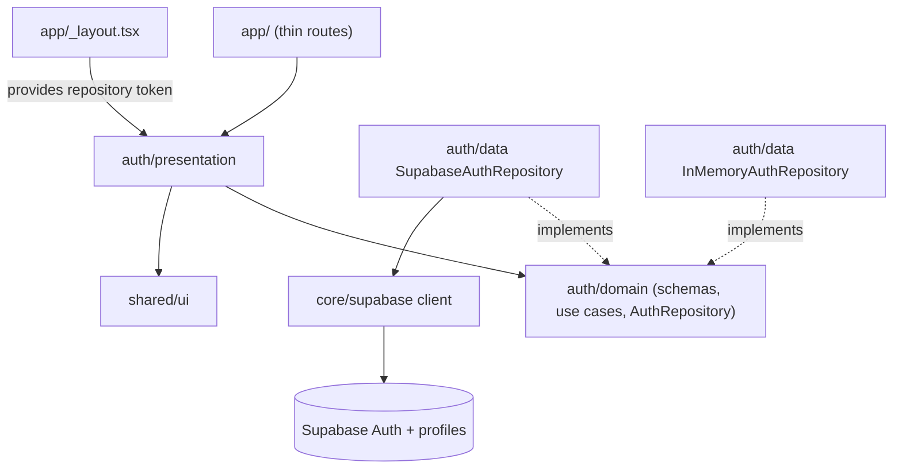

# Auth Design

**Spec**: `.specs/features/auth/spec.md`
**Status**: Approved

---

## Architecture Overview

First feature module. It sets the pattern `circles`, `pacts`, `stories` and `meetups` copy: `domain` (pure TypeScript: entities, repository interface, Zod schemas, use cases), `data` (in-memory and Supabase repositories, error and user mappers), `presentation` (session provider, hooks, screens, route gate), all behind `src/modules/auth/index.ts` (AD-001, AD-002).

Session state is one Context, `SessionProvider`, fed by the repository. Route protection is declarative: a root navigator renders Expo Router `Stack.Protected` groups from that state, so redirects (AUTH-08) are the router's job, not hand-written `useEffect` navigation.



Dependency direction: `presentation → domain ← data`. Only `app/_layout.tsx` knows which repository implementation is wired.

### Approaches considered (route protection)

| Approach | How | Trade-off |
| -------- | --- | --------- |
| **A. `Stack.Protected` groups (chosen)** | Root `Stack` with `<Stack.Protected guard={signedIn}>` for `(app)` and `guard={!signedIn}` for `(auth)`; a loading state renders no stack | Redirects, deep links and back-stack cleanup are handled by the router; present in the installed `expo-router` (`build/views/Protected.d.ts`) |
| B. `<Redirect>` in each layout | `useSession` in `(app)/_layout` and `(auth)/_layout`, redirect on mismatch | Works on older routers; duplicates the check in two layouts and flashes content unless guarded by hand |
| C. `useEffect` + `router.replace` | Imperative navigation on session change | Race-prone with deep links; the protected screen can render once before redirecting (violates AUTH-07 AC3) |

Chosen: **A**.

### Approaches considered (display name persistence)

| Approach | How | Trade-off |
| -------- | --- | --------- |
| **A. Metadata plus DB trigger (chosen)** | `signUp` sends `options.data.display_name`; a `security definer` trigger on `auth.users` inserts the `profiles` row; the app reads the name from `user.user_metadata` | One network call, atomic with account creation, works with confirm-email off or on, no client-side RLS write |
| B. Client inserts `profiles` after `signUp` | Second request from the app | Two calls: a failure between them leaves an account without a profile; needs an insert RLS policy |
| C. Postgres function called via RPC | Same as B with a function | Same partial-failure window |

Chosen: **A**. `profiles` is created for `circles` memberships to join against; auth itself never queries it.

---

## Code Reuse Analysis

### Existing Components to Leverage

| Component | Location | How to Use |
| --------- | -------- | ---------- |
| `AppError`, `Result`, `ok`, `err`, `createAppError`, `mapError` | `src/core/errors` | Every repository and use case returns `Result<T>`; `mapError` is the fallback for unknown throws |
| `createToken`, `provide`, `DependencyProvider`, `useDependency` | `src/core/di` | `authRepositoryToken`; `app/_layout.tsx` provides the Supabase implementation, tests provide `InMemoryAuthRepository` |
| `Screen`, `Text`, `TextField`, `Button`, `ErrorBanner` | `src/shared/ui` | Both forms; `ErrorBanner` already supports `onRetry` ("Tentar novamente") and `Button` already ignores presses while `loading` |
| `useTheme` | `src/core/theme` | Loading indicator and link colors through semantic roles (AD-006) |
| ESLint boundary and purity rules | `eslint.config.js`, `tooling/modules.js` | `auth` is already in `MODULES`; domain may not import React, Expo or Supabase |
| `renderRouter` | `expo-router/testing-library` (present in `node_modules`) | Tests the route gate against an in-memory route tree |

### Integration Points

| System | Integration Method |
| ------ | ------------------ |
| Supabase Auth | `signUp`, `signInWithPassword`, `signOut`, `getSession`, `onAuthStateChange` inside `SupabaseAuthRepository` only |
| Supabase Postgres | `public.profiles` table plus `handle_new_user` trigger, delivered as `supabase/migrations/0001_profiles.sql` |
| Expo Router | `app/_layout.tsx` composes providers and `RootNavigator`; route groups `(auth)` and `(app)` |
| Future modules | Read the signed-in user through `useSession()` exported from `@/modules/auth`; never import auth internals (AD-007) |

---

## Components

### Supabase config and client (`src/core/supabase`)

- **Purpose**: Single configured client for the whole app, built from public env vars.
- **Location**: `supabase-config.ts`, `client.ts`, `index.ts`
- **Interfaces**:
  - `readSupabaseConfig(env: Record<string, string | undefined>): { url: string; publishableKey: string }` - throws `Error('Missing EXPO_PUBLIC_SUPABASE_URL')` (names the variable, never prints values) when absent or blank
  - `supabase: SupabaseClient` - created from `readSupabaseConfig(process.env)`; `AsyncStorage` on native, default storage on web, `persistSession`, `autoRefreshToken`, `detectSessionInUrl: false`; native-only `AppState` listener starting and stopping auto refresh (pattern from the Supabase Expo quickstart)
- **Dependencies**: `@supabase/supabase-js`, `@react-native-async-storage/async-storage`, `react-native-url-polyfill`
- **Reuses**: nothing

### Domain (`src/modules/auth/domain`)

- **Purpose**: Entities, contract and rules, no framework imports.
- **Location**: `auth-user.ts`, `auth-repository.ts`, `auth-schemas.ts`, `register-user.ts`, `sign-in-user.ts`, `sign-out-user.ts`, `restore-session.ts`
- **Interfaces**:
  - `interface AuthUser { id: string; email: string; displayName: string }`
  - `interface AuthRepository { signUp(input: RegisterInput): Promise<Result<AuthUser>>; signIn(input: SignInInput): Promise<Result<AuthUser>>; signOut(): Promise<Result<void>>; getCurrentUser(): Promise<Result<AuthUser | null>>; subscribe(listener: (user: AuthUser | null) => void): () => void }`
  - `authRepositoryToken: Token<AuthRepository>`
  - `registerSchema` (`displayName` trim, 2-40; `email` trim, lowercase, valid; `password` min 8), `signInSchema` (`email` trim, lowercase, required; `password` required), with the pt-BR messages from the spec
  - `registerUser(repo, input: unknown): Promise<Result<AuthUser>>` - parse then `repo.signUp`; invalid input returns a `validation` error and never reaches the repository
  - `signInUser(repo, input: unknown)`, `signOutUser(repo)`, `restoreSession(repo): Promise<AuthUser | null>` - any error resolves to `null` (AUTH-07 AC6)
- **Dependencies**: `zod`, `core/errors`, `core/di`
- **Reuses**: `Result`, `createAppError`, `createToken`

### Data (`src/modules/auth/data`)

- **Purpose**: Two interchangeable repositories and the translation boundary (raw backend text never leaves this folder).
- **Location**: `in-memory-auth-repository.ts`, `supabase-auth-repository.ts`, `map-auth-error.ts`, `map-auth-user.ts`
- **Interfaces**:
  - `mapAuthError(thrownOrAuthError: unknown): AppError` - by `error.code`: `invalid_credentials` to `unauthorized` ("E-mail ou senha incorretos"); `user_already_exists` or `email_exists` to `conflict` ("Este e-mail já está cadastrado"); `weak_password` to `validation`; network failures (`name === 'AuthRetryableFetchError'`, or a `TypeError` matched by `mapError`) to `network`; anything else to `unknown`. The returned message is always ours, never `error.message`.
  - `mapAuthUser(user: { id; email?; user_metadata? }): AuthUser` - `displayName` from `user_metadata.display_name`, falling back to the part of the e-mail before `@`
  - `InMemoryAuthRepository` - Map of e-mail to credentials, in-memory session, listeners notified on sign-in and sign-out; honors the same `Result` contract and error codes as the Supabase version
  - `SupabaseAuthRepository(client)` - thin adapter; `signUp` fails with `unknown` if Supabase returns no session (confirm-email accidentally on)
- **Dependencies**: `core/errors`; Supabase repository takes the client by constructor (no module-level import of the singleton, keeps it injectable)
- **Reuses**: `mapError` for the `TypeError` network case

### Presentation (`src/modules/auth/presentation`)

- **Purpose**: Session state, form screens, route gate.
- **Location**: `session-provider.tsx`, `use-auth-action.ts`, `sign-in-screen.tsx`, `register-screen.tsx`, `home-screen.tsx`, `root-navigator.tsx`
- **Interfaces**:
  - `SessionProvider({ children })` and `useSession(): { status: 'loading' | 'signedIn' | 'signedOut'; user: AuthUser | null }` - starts `loading`, resolves through `restoreSession`, then follows `repo.subscribe`; unsubscribes on unmount
  - `useAuthAction<A extends unknown[], T>(action: (...a: A) => Promise<Result<T>>)`: `{ run, pending, error, retry }` - a ref-based lock makes a second `run` while pending a no-op (edge case "submitted twice quickly"); `retry` re-runs the last arguments
  - `SignInScreen({ onNavigateToRegister })`, `RegisterScreen({ onNavigateToSignIn })` - react-hook-form with `zodResolver`, field errors from the schema messages, `ErrorBanner` for repository errors with `onRetry` only for `network`
  - `HomeScreen()` - placeholder main area: greeting with `displayName` and a "Sair" button (replaced by the circles list later; `circles` owns this route afterwards)
  - `RootNavigator()` - `loading` renders a centered `ActivityIndicator` and no `Stack`; otherwise `Stack` with `Protected guard={status === 'signedIn'}` around `(app)` and `Protected guard={status === 'signedOut'}` around `(auth)`
- **Dependencies**: `react-hook-form`, `@hookform/resolvers`, `expo-router`, `core/di`, `shared/ui`
- **Reuses**: `ErrorBanner`, `Button` loading state, `TextField` error slot

### Public API and routes

- `src/modules/auth/index.ts` exports: `SessionProvider`, `useSession`, `RootNavigator`, `SignInScreen`, `RegisterScreen`, `HomeScreen`, `InMemoryAuthRepository`, `SupabaseAuthRepository`, `authRepositoryToken`, type `AuthUser`.
- Routes: `app/(auth)/sign-in.tsx`, `app/(auth)/register.tsx`, `app/(app)/index.tsx` (replaces `app/index.tsx`), each a few lines rendering the screen and wiring navigation callbacks (`router.push` between the two auth screens).
- `app/_layout.tsx` provides `authRepositoryToken` with `new SupabaseAuthRepository(supabase)`, wraps `SessionProvider`, renders `RootNavigator`.

---

## Data Models

### Profile (Postgres)

```sql
create table public.profiles (
  id uuid primary key references auth.users (id) on delete cascade,
  display_name text not null check (char_length(display_name) between 2 and 40),
  created_at timestamptz not null default now()
);
alter table public.profiles enable row level security;
-- select and update only the own row; no insert/delete policy (the trigger inserts as definer)
create policy "profiles_select_own" on public.profiles for select to authenticated using ((select auth.uid()) = id);
create policy "profiles_update_own" on public.profiles for update to authenticated using ((select auth.uid()) = id) with check ((select auth.uid()) = id);
-- trigger function: security definer, empty search_path, reads raw_user_meta_data->>'display_name'
```

The `circles` migration later adds a policy so circle members can read each other's `display_name`.

**Relationships**: `profiles.id` is 1:1 with `auth.users.id`; `circles` memberships will reference `profiles.id`.

---

## Error Handling Strategy

| Error Scenario | Handling | User Impact |
| -------------- | -------- | ----------- |
| Wrong e-mail or password | `mapAuthError` returns `unauthorized` with fixed message | Banner "E-mail ou senha incorretos" |
| E-mail already registered | `conflict` with fixed message | Banner "Este e-mail já está cadastrado" |
| No connectivity | `network` | Banner with the Foundation `network` text and "Tentar novamente" that re-runs the last submit |
| Unexpected backend error | `unknown` | "Algo deu errado. Tente novamente." |
| Invalid field values | Zod messages through react-hook-form; repository not called | Field-level pt-BR messages |
| Stored session expired or refresh fails | `restoreSession` resolves `null` | Sign-in screen, no error shown |
| Missing env vars | `readSupabaseConfig` throws a named-variable error at startup | Developer-time failure |

---

## Risks & Concerns

| Concern | Location (file:line) | Impact | Mitigation |
| ------- | -------------------- | ------ | ---------- |
| Packages not installed yet (`@supabase/supabase-js`, `@react-native-async-storage/async-storage`, `react-native-url-polyfill`, `zod`, `react-hook-form`, `@hookform/resolvers`); versions newer than my knowledge (Zod major, supabase-js `processLock`) | `package.json` | API shapes (`z.email()` vs `z.string().email()`, `lock` option) may differ | T1 installs with `npx expo install` and reads installed typings; T6 and T4 adapt to what is installed and fail loudly instead of assuming |
| Supabase error `code` strings and the network error class are taken from documentation, not observed | `src/modules/auth/data/map-auth-error.ts` | Wrong code falls through to `unknown` and the user sees a generic message | T12 tests every mapping from the documented names; T25 manually triggers duplicate e-mail, wrong password and airplane mode against the real project and corrects mappings |
| Supabase repository has no automated coverage (AD-002) | `supabase-auth-repository.ts` | Adapter bugs only surface in manual testing | Keep it a thin adapter with all logic in tested mappers; T25 is a scripted manual check of every spec AC |
| "Confirm email" must be off; if on, `signUp` yields no session | Supabase dashboard | Register appears to hang | Adapter returns `unknown` when no session is returned; T25 starts by verifying the setting |
| Route group names `(app)`, `(auth)` are duplicated between `RootNavigator` and `app/` folders | `root-navigator.tsx`, `app/` | Renaming a folder silently breaks the gate | `renderRouter` test in T20 builds the tree with the same names; T24 re-runs it against the real layout wiring |
| `Stack.Protected` is recent; `renderRouter` behavior with it is unverified | `root-navigator.tsx` test | Test harness may not model redirects | T20 starts by reading the installed `expo-router` typings and a spike render; falls back to asserting guard props if the harness cannot model it (decision recorded in the commit body) |
| `app/index.tsx` and its test exist from Foundation | `app/index.tsx`, `tooling/__tests__/home-route.test.tsx` | Duplicate root route next to `(app)/index` | T23 moves the route and its test together |
| Applying the migration changes the real database | `supabase/migrations/0001_profiles.sql` | Production DB change | Never applied automatically; T25 asks for an explicit go-ahead, then applies (or the user pastes it in the SQL editor) |

---

## Tech Decisions (only non-obvious ones)

| Decision | Choice | Rationale |
| -------- | ------ | --------- |
| Display name source | `user.user_metadata.display_name` | Avoids a `profiles` query on every session restore; the row exists only for joins |
| Client-side vs use-case validation | Screens validate with the shared Zod schema for field errors; use cases re-parse the same schema | Field messages in the UI, and a domain guarantee that the repository is never called with invalid input |
| `signInSchema` password rule | Required only, not min 8 | Existing accounts must not be locked out by a client rule; the spec only asks for "Campo obrigatório" |
| Double-submit protection | Ref lock in `useAuthAction` on top of `Button` loading | State updates are async; the ref closes the window between two presses |
| Raw backend text | Never read `error.message` | AUTH-06 AC6; mapping is by `code` and error class only |
| Session store | Context (`SessionProvider`), no TanStack Query | Global client state is limited to the session (PROJECT_CONTEXT section 8); Query is for server data |

> **Project-level decision:** appended to `.specs/STATE.md` as AD-007 (session access and route protection convention).
