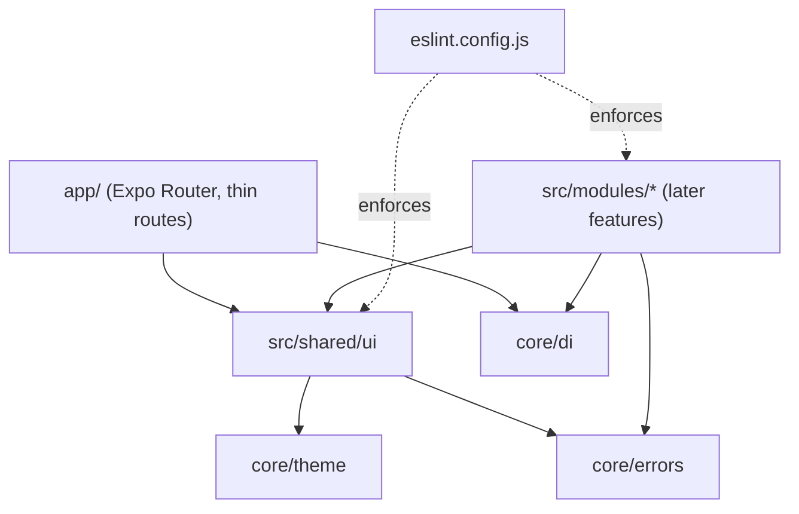

# Foundation Design

**Spec**: `.specs/features/foundation/spec.md`
**Status**: Draft

---

## Architecture Overview

Greenfield. The repo has no code yet, so this design sets the skeleton every later module follows: thin Expo Router routes in `app/`, shared kernel in `src/core` and `src/shared`, feature modules in `src/modules` (empty for now), and ESLint as the enforcement point for AD-001 and AD-006.

Dependency direction: `app → shared → core`, `modules → shared, core`. `core` imports nothing from `shared`, `modules` or `app`.

### Approaches considered (module-boundary enforcement)

| Approach | How | Trade-off |
| -------- | --- | --------- |
| **A. Generated `no-restricted-imports` overrides (chosen)** | One ESLint override per module listing the other modules' internal paths as restricted patterns; a test asserts the module list matches `src/modules/*` | Zero new dependencies and works with relative and alias paths; the module list is one array to maintain, guarded by a test |
| B. `eslint-plugin-boundaries` | Declarative element types and rules | Extra dependency and resolver setup; version 7.2.0 and its ESLint 10 support are unverified here |
| C. `dependency-cruiser` | Separate CLI over the import graph | A second tool outside `npm run lint`, so the gate would not catch violations |

Chosen: **A**. Domain purity (AC 6) and the hex ban (AC 7) use the same built-in rules (`no-restricted-imports`, `no-restricted-syntax`), so the whole guard-rail set needs no plugin.

---

## Code Reuse Analysis

### Existing Components to Leverage

| Component | Location | How to Use |
| --------- | -------- | ---------- |
| Palette and role mapping | `docs/DESIGN_SYSTEM.md` | Copy the reference TypeScript tokens verbatim into `src/core/theme/colors.ts` |
| Expo blank-TypeScript template | `create-expo-app` | Starting point; template demo content is removed |
| `eslint-config-expo` | npm | Base ESLint config; custom rules layered on top |
| `jest-expo` preset | npm | Jest environment for React Native |

### Integration Points

| System | Integration Method |
| ------ | ------------------ |
| Expo Router | `app/_layout.tsx` wraps the tree in `DependencyProvider`; `app/index.tsx` renders `Screen` |
| Future modules | Import from `@/core/*` and `@/shared/*` only; expose themselves through `index.ts` |

---

## Components

### Errors (`src/core/errors`)

- **Purpose**: One vocabulary for failures: `AppError`, `Result`, and a mapper from unknown thrown values.
- **Location**: `src/core/errors/app-error.ts`, `result.ts`, `map-error.ts`, `index.ts`
- **Interfaces**:
  - `type ErrorCode = 'network' | 'validation' | 'unauthorized' | 'not_found' | 'conflict' | 'unknown'`
  - `interface AppError { code: ErrorCode; message: string }` (plain object, serializable)
  - `createAppError(code: ErrorCode, message?: string): AppError` - default pt-BR message per code
  - `type Result<T> = { ok: true; value: T } | { ok: false; error: AppError }`
  - `ok<T>(value: T): Result<T>`, `err(error: AppError): Result<never>`
  - `mapError(thrown: unknown): AppError` - `network` for a `TypeError` whose message matches `/network request failed|failed to fetch|network error/i`; an existing `AppError` passes through unchanged; everything else is `unknown`
- **Dependencies**: none (pure TypeScript)
- **Reuses**: nothing

### Theme (`src/core/theme`)

- **Purpose**: Color roles and layout tokens; the only place hex values may live (AD-006).
- **Location**: `colors.ts`, `tokens.ts`, `use-theme.ts`, `index.ts`
- **Interfaces**:
  - `palette`, `lightColors`, `darkColors`, `ColorRole` (exactly as `docs/DESIGN_SYSTEM.md`)
  - `typography` (font sizes and weights, `fontFamily` left replaceable) and `spacing` (4-based scale), `minTouchTarget = 44`
  - `useTheme(): { colors: typeof lightColors; spacing; typography }` - returns light colors (design system ships light first)
- **Dependencies**: React (hook only)
- **Reuses**: `docs/DESIGN_SYSTEM.md`

### Dependency injection (`src/core/di`)

- **Purpose**: Typed service lookup without prop drilling or a global singleton (AD-002).
- **Location**: `src/core/di/dependency-provider.tsx`, `index.ts`
- **Interfaces**:
  - `createToken<T>(name: string): Token<T>`
  - `provide<T>(token: Token<T>, value: T): Provision`
  - `<DependencyProvider provisions={Provision[]}>children</DependencyProvider>`
  - `useDependency<T>(token: Token<T>): T` - throws `Error('Dependency "<name>" is not registered')` when absent
- **Dependencies**: React Context
- **Reuses**: nothing

### Shared UI (`src/shared/ui`)

- **Purpose**: Five primitives the `auth` screens need immediately; all colors through roles (AD-006).
- **Location**: `text.tsx`, `screen.tsx`, `button.tsx`, `text-field.tsx`, `error-banner.tsx`, `index.ts`
- **Interfaces**:
  - `Text({ variant?: 'primary' | 'secondary', ...TextProps })` - default `textPrimary`
  - `Screen({ children })` - `SafeAreaView` + `background` color + keyboard avoidance
  - `Button({ label, onPress, loading?, disabled? })` - `accent` background, `onAccent` text, min height 44, ignores presses while `loading`/`disabled`
  - `TextField({ label, value, onChangeText, error?, ...TextInputProps })` - min height 44, shows `error` below and sets it as accessibility hint
  - `ErrorBanner({ error?: AppError | null, onRetry?: () => void })` - renders nothing without `error`; `accent` background, `onAccent` text; shows "Tentar novamente" button only with `onRetry`
- **Dependencies**: `core/theme`, `core/errors`
- **Reuses**: `Button` inside `ErrorBanner`, `Text` inside all

### Lint guard-rails (`eslint.config.js`)

- **Purpose**: Make AD-001 and AD-006 gates, not conventions.
- **Rules**:
  - **Module boundary** (FND-03): for each name in `MODULES = ['auth','circles','pacts','stories','meetups']`, an override on `src/modules/<name>/**` restricts imports matching `**/<other>/*` and `**/<other>/*/**` for every other module. `@/modules/<other>` (the `index.ts`) stays allowed.
  - **Domain purity** (FND-03): override on `src/modules/*/domain/**` restricts `react`, `react-native`, `expo`, `expo-*`, `@supabase/*`.
  - **Hex ban** (FND-10): `no-restricted-syntax` selector on string literals matching `^#([0-9a-fA-F]{3,4}|[0-9a-fA-F]{6}|[0-9a-fA-F]{8})$`, applied to `src/**` and turned off for `src/core/theme/**`.
- **Test strategy**: `tooling/__tests__/lint-rules.test.ts` runs the ESLint Node API on virtual files (`lintText` with a `filePath`) in a `@jest-environment node` suite, asserting violation and non-violation cases. A second test asserts every directory in `src/modules/` appears in `MODULES`.

---

## Data Models

None. This feature has no persisted data.

---

## Error Handling Strategy

| Error Scenario | Handling | User Impact |
| -------------- | -------- | ----------- |
| Unknown thrown value | `mapError` returns `unknown` | "Algo deu errado. Tente novamente." |
| Fetch/network failure | `mapError` returns `network` | "Sem conexão. Verifique sua internet e tente novamente." |
| Missing dependency in provider | `useDependency` throws naming the token | Developer-time error, caught by tests |
| Adding a module without updating `MODULES` | Guard test fails | Developer-time error |

---

## Risks & Concerns

| Concern | Location (file:line) | Impact | Mitigation |
| ------- | -------------------- | ------ | ---------- |
| npm resolves versions newer than the author's knowledge (Expo 57.0.x, ESLint 10.12, TypeScript 7.0.2, React Native 0.87) | `package.json` (to be created) | Config shapes, flat-config API or Jest preset behavior may differ from memory | Scaffold with `create-expo-app` and install with `npx expo install` so Expo pins compatible versions; consult the installed packages' docs and fail loudly instead of assuming; T1 and T3 verify before building on them |
| `ESLint` Node API options for flat config may differ in ESLint 10 | `tooling/__tests__/lint-rules.test.ts` | Rule tests could not run | Fall back to the `Linter` class with an explicit config array if `new ESLint({ overrideConfigFile })` misbehaves; decided at T6 |
| Expo Go might not yet support the scaffolded SDK on the user's device | runtime | App cannot be opened in Expo Go | Verify on web (`expo start --web`) as the primary path (AD-004 allows web or emulator); check Expo Go compatibility when the user tests |
| Relative-path bypass of boundary rule | `eslint.config.js` | A cross-module deep import slips past | Patterns cover relative and alias forms (`**/<other>/*`); the test covers both forms |
| Windows CRLF/LF mismatch | `.prettierrc` | Noisy lint and diff output | Prettier `endOfLine: 'auto'` |
| Jest + new React Native version friction | `jest.config.js` | Slow start | Use the `jest-expo` preset that `expo install` selects; keep the setup minimal |

---

## Tech Decisions (only non-obvious ones)

| Decision | Choice | Rationale |
| -------- | ------ | --------- |
| `AppError` representation | Plain object, not an `Error` subclass | Serializable, trivially compared in tests, works with `Result` without `instanceof` pitfalls |
| Network detection | Message regex on `TypeError` | React Native and web `fetch` both throw `TypeError` on network failure; feature data layers refine this for their own SDKs |
| DI keys | Typed tokens via `createToken<T>()` | Compile-time typing without module augmentation or string keys |
| Lint-rule tests | ESLint Node API inside Jest | Keeps "lint SHALL fail" ACs verifiable by `npm test` |
| Config files location | `tooling/` for tests of tooling, root for config | Keeps `src/` for app code so the hex ban scope (`src/**`) stays clean |
| Hex ban scope | Applies to `src/**` only | Tests of the lint rules need hex literals as sample input |
